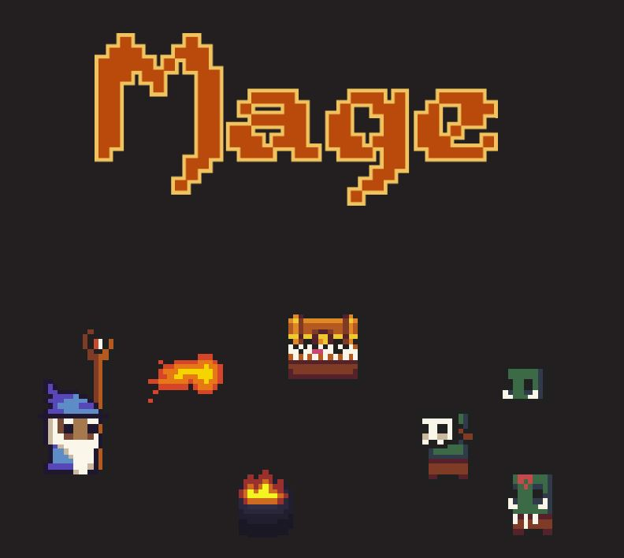
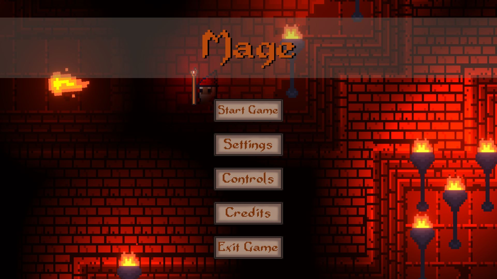
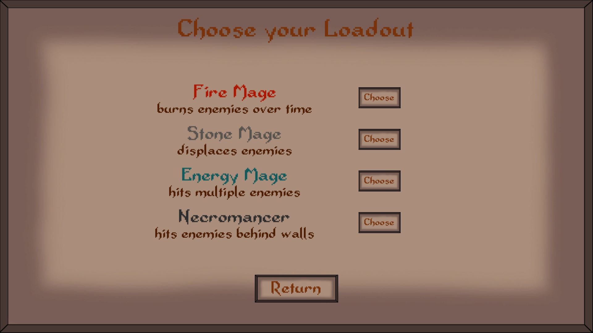
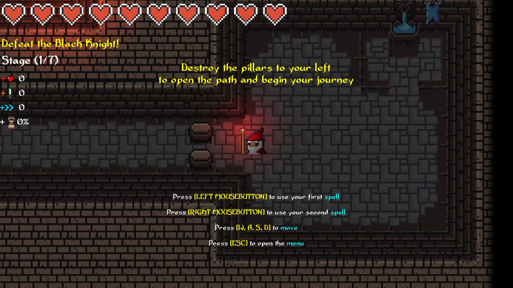
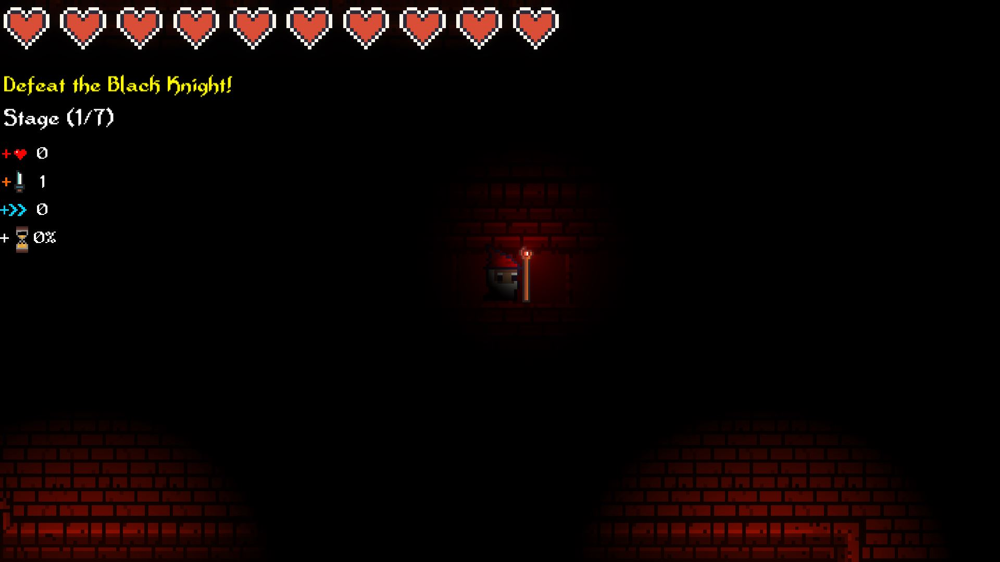

# Game: Mage 2021

A Unity game. Developed for a university project.
Mage is a 2D roguelike with pixel graphics.

**Core Features**
 * 4 different playable characters with different skillsets
 * Procedurally generated maps
 * Difficulty modes
 * Different enemies with different attacks and behaviors
 * Enemies can group up and attack the player as a group
 * Boss fights which increase in difficulty
 * timer will show how fast you beat the game upon completion

**Developed by:**
 * [Sven Tippner](https://github.com/sventippner)
 * [Martin Ludwig](https://github.com/Martin-Ludwig)
 * [Tom Gr.](https://github.com/Tom-G-r)

Most of the sprites and graphics are from the [Dungeontileset II](https://0x72.itch.io/dungeontileset-ii) developed by [0x72](https://twitter.com/_0x72_)

This repository contains just the scripts of the game like Enemy behavior, interface, map-creation and spells.

# Get the latest release here:
 * [Link to Release](https://github.com/Tom-G-r/Game-Mage/releases/latest)

# Story:
Choose one of 4 different mages to defeat the Black Knights. In the end a timer shows you your completion time. On your journey you are going to learn the structure of the maps,  the strengths and weaknesses of the different monsters and if the exchange of time and power-ups are worth it. Stage after stage the enemies will increase in power.

# Impressions

